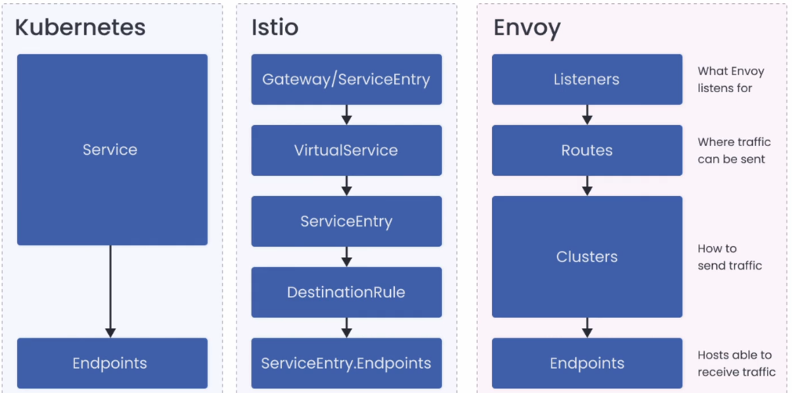

# Istio Service Mesh

## Tutorials:
- Istio Fundamentals https://academy.tetrate.io/courses/istio-fundamentals



## Install Istio using Tetrate's "getmesh"

Note: `istioctl` will become a subcommand of getmesh.  
Once you have kubernetes cluster running and accessible with kubectl:
```sh
# install "getmesh" istio installer
curl -sL https://istio.tetratelabs.io/getmesh/install.sh | bash
getmesh version

# install istio in current cluster. Profile "demo" is for learning purposes - it brings basic istio components and higher tracing level
getmesh istioctl install --set profile=demo
getmesh config-validate
```

## Install Istio using installation package

Once you have kubernetes cluster running and accessible with kubectl:
```sh
# download the latest installation package
curl -L https://istio.io/downloadIstio | sh -

# add istioclt to PATH
export PATH=$PWD/istio-1.14.3/bin/:$PATH

# install istio in current cluster. Profile "demo" is for learning purposes - it brings basic istio components and higher tracing level
istioctl install --set profile=demo

# install istio operator
istioctl operator init

# create istio operator CRD in cluster
echo "apiVersion: install.istio.io/v1alpha1
kind: IstioOperator
metadata:
  namespace: istio-system
  name: demo-istio-install
spec:
  profile: demo" | kubectl apply -f -

# wait till "demo-istio-install" CRD is in HEALTHY state
kubectl get istiooperator -n istio-system -w
```


## Validate Istio installation
```sh
# istio gets installed in kubernetes "istio-system" namespace
kubectl get all -n istio-system

# specifically, the istiooperator gets installed and it holds the istio configuration
kubectl get istiooperator -n istio-system
```

## Run nginx with Istio:
```sh
# create dedicated "mesh" namespace
kubectl create ns mesh

# mark the namespace as requiring istio sidecar proxy injection
kubectl label namespace mesh istio-injection=enabled

# run nginx pod
kubectl run nginx --image=nginx --labels=app=nginx -n mesh

# see sidecar injected - there will be NginX container and Istio sidecar container in this POD
kubectl get pod/nginx -n mesh

# expose nginx
kubectl create service nodeport nginx --tcp=80:80 --node-port=31000 -n mesh

# check nginx running
curl `minikube ip`:31000
```

## Uninstall Istio
```sh
# first delete the operator's resources so there is no leftovers
kubectl delete istiooperator/installed-state -n istio-system

# then uninstall the operator itself
istioctl x uninstall --purge
```

## Some istioctl commands
- `istioctl profile list` - list available profiles for installing in the cluster
- `istioctl proxy-config endpoints nginx -n mesh` - list endpoints in pod `nginx` in namespace `mesh`