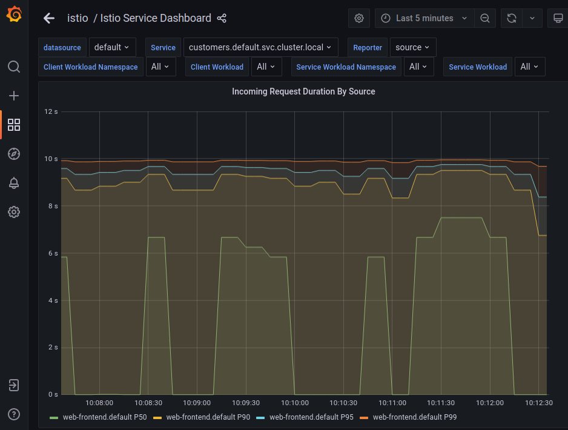
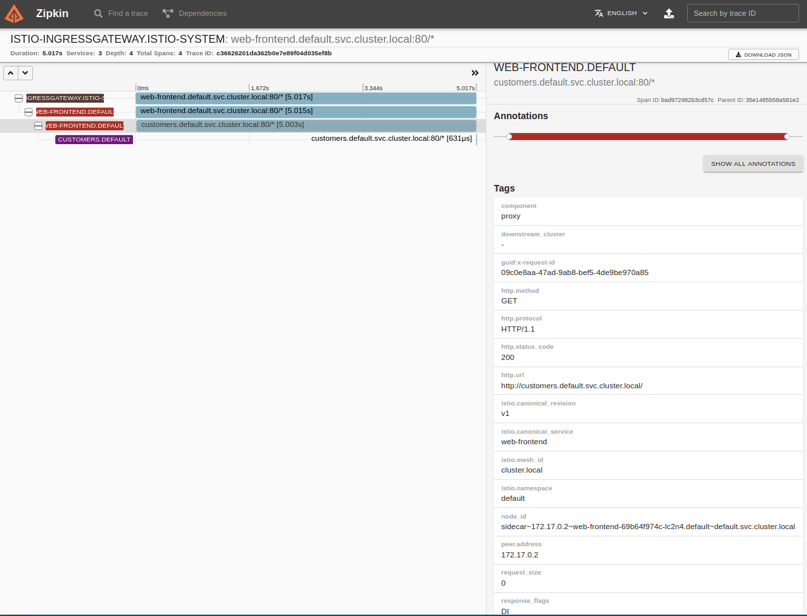
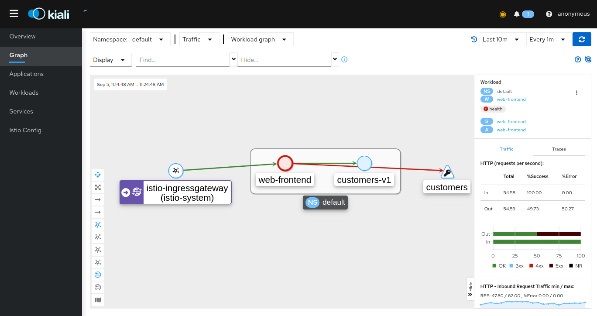

# Observing failure injection

Based on https://academy.tetrate.io/courses/take/istio-fundamentals/lessons/19068816-lab-2-observing-failure-injection

## Prerequisites

- clean minikube cluster
- Istio Demo profile installed
- `default` namespace labeled for istio sidecar auto-injection: istio-injection=enabled
- [Prometheus, Grafana, Zipkin addons installed](../addons/README.md)

## Steps 

- create Ingress Gateway
	```sh
	kubectl apply -f gateway.yaml
    kubectl get gateway
    NAME               AGE
    gateway            60s    
	```

- get and remember ingress IP (minikube tunnel first, to get External IP)
    ```sh
    kubectl get svc -n istio-system -l app=istio-ingressgateway
    NAME                   TYPE           CLUSTER-IP    EXTERNAL-IP   PORT(S)                                                                      AGE
    istio-ingressgateway   LoadBalancer   10.98.23.63   10.98.23.63   15021:30356/TCP,80:32547/TCP,443:32524/TCP,31400:30726/TCP,15443:30339/TCP   4d4h
    export GATEWAY_URL=10.98.23.63
    ```

- create the web-frontend (deployment + service + virtual service)
    ```sh
    kubectl apply -f web-frontend.yaml
    kubectl get deploy,pod,svc,vs
    NAME                           READY   UP-TO-DATE   AVAILABLE   AGE
    deployment.apps/web-frontend   1/1     1            1           85s

    NAME                                READY   STATUS    RESTARTS   AGE
    pod/web-frontend-69b64f974c-nrkqd   2/2     Running   0          85s

    NAME                   TYPE        CLUSTER-IP     EXTERNAL-IP   PORT(S)   AGE
    service/kubernetes     ClusterIP   10.96.0.1      <none>        443/TCP   237d
    service/web-frontend   ClusterIP   10.97.236.22   <none>        80/TCP    85s

    NAME                                              GATEWAYS               HOSTS   AGE
    virtualservice.networking.istio.io/web-frontend   ["gateway"]            ["*"]   85s
    ```
    Envoy proxy sidecar is automatically injected in the application's Pod

- create the customers (deployment + service + destination rule + virtual service)
    ```sh
    kubectl apply -f customers.yaml
    kubectl get deploy,pod,svc,dr,vs
    NAME                           READY   UP-TO-DATE   AVAILABLE   AGE
    deployment.apps/customers-v1   1/1     1            1           2m32s
    deployment.apps/web-frontend   1/1     1            1           14m

    NAME                                READY   STATUS    RESTARTS   AGE
    pod/customers-v1-7b5b4b76fc-dv2gg   2/2     Running   0          2m32s
    pod/web-frontend-69b64f974c-lc2n4   2/2     Running   0          14m

    NAME                   TYPE        CLUSTER-IP      EXTERNAL-IP   PORT(S)   AGE
    service/customers      ClusterIP   10.99.232.56    <none>        80/TCP    2m32s
    service/kubernetes     ClusterIP   10.96.0.1       <none>        443/TCP   240d
    service/web-frontend   ClusterIP   10.96.135.185   <none>        80/TCP    14m

    NAME                                            HOST                                  AGE
    destinationrule.networking.istio.io/customers   customers.default.svc.cluster.local   2m32s

    NAME                                              GATEWAYS      HOSTS                                     AGE
    virtualservice.networking.istio.io/customers                    ["customers.default.svc.cluster.local"]   2m32s
    virtualservice.networking.istio.io/web-frontend   ["gateway"]   ["*"]                                     14m
    ```

- open the frontend page
    ```sh
    firefox $GATEWAY_URL
    ```

- configure 5s delays for 50% of the traffic towards customers. This updates the "customers" Virtual Service, doesn't create a new one
    ```sh
    kubectl apply -f customers-delay.yaml
    kubectl get vs
    NAME           GATEWAYS      HOSTS                                     AGE
    customers                    ["customers.default.svc.cluster.local"]   26m
    web-frontend   ["gateway"]   ["*"]                                     38m
    ```

- start sending requests in a loop
    ```sh
    while true; do curl http://$GATEWAY_URL/; done
    ```

- see Grafana
    ```sh
    istioctl dashboard grafana
    ```
  - navigate to Home->Istio Service Dashboard->Client Workload
  - make sure the dropdown `Service` is "customers.default.svc.cluster.local" and `Reporter` is "source"
  - then in tile `Incoming Request Duration By Source` select View
  

- see Zipkinn
    ```sh
    istioctlk dash zipkin
    ```
  - click "+", serviceName=web-frontend.default, minDuration=5s, RUN QUERY
  
  , select first one; response_flags `DI` means Delay Injection
  

- now configure http 500 error for 50% of the traffic towards customers
    ```sh
    kubectl apply -f customers-fault.yaml
    ```
    - in Grafana observe `Incoming Success Rate` tile values drop to ~50%
    - in Zipkin observe failed traces with response_flag `FI` - Failure Injection

- see Kiali
    ```sh
    istioctl dash kiali
    ```
    , navigate Graphs, select Workload Graph
    
    - observe half responses to web-frontend is error http 5xx

## Clean Up

```sh
kubectl delete deploy web-frontend customers-v1
kubectl delete svc customers web-frontend
kubectl delete vs customers web-frontend
kubectl delete gateway gateway
```