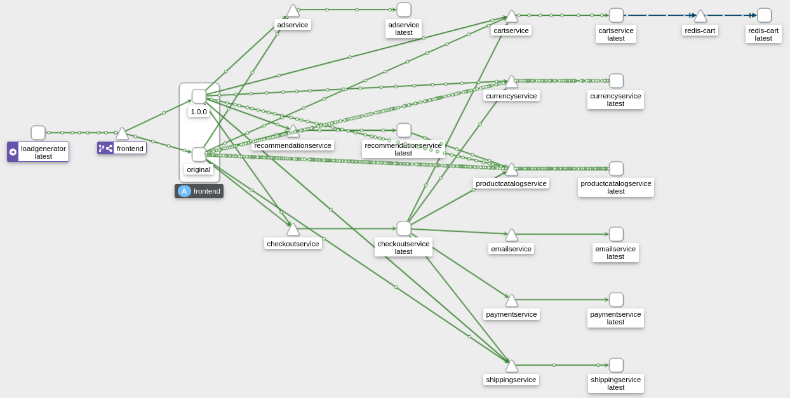

# Real World Example - Boutique webapp

Actual example should use managed Kubernetes cluster in cloud, but Minikube will do.  
Based on https://academy.tetrate.io/courses/take/istio-fundamentals/lessons/19067705-8-3-deploy-online-boutique-app  
This example is changed - instead of introducing routing in `frontend-ingress` VirtualService that only receives traffic from the gateway, we introduce routing in `frontend` VirtualService, that receives traffic from both, the gateway and from loadgenerator. This is to better depict traffic routing in Kiali (otherwise loadgenerator will ignore our routing)

## Prerequisites

- clean minikube cluster **with 8GB memory**: `minikube start --memory 8192`
- Istio Demo profile installed
- `default` namespace labeled as istio-injection=enabled

## Steps 

- clone the Boutique app
    ```sh
    git clone https://github.com/GoogleCloudPlatform/microservices-demo.git
    ```

- deploy the app in cluster. This can tak 7 minutes and 6 restarts for some pods to get running
    ```sh
    kubectl apply -f microservices-demo/release/kubernetes-manifests.yaml
    ```
    
- check if app is running
    ```sh
    minikube service frontend-external
    ```

- deploy istio resources
    ```sh
    kubectl apply -f microservices-demo/istio-manifests
    ```

- delete the app loadbalancer - we will use the one provided by Istio
    ```sh
    kubectl delete svc frontend-external
    ```

- get the ingress IP and check it is working
    ```sh
    INGRESS_HOST="$(kubectl -n istio-system get service istio-ingressgateway -o jsonpath='{.status.loadBalancer.ingress[0].ip}')"
    curl "$INGRESS_HOST"
    ```

- run Kiali->Graph, select Display->Traffic animation and see auto-generated traffic spreads across the mesh
    ```sh
    istioctl dash kiali
    ```

- now lets run frontend version:1.0.0 along with frontend version:original and see traffic equally routed to both versions
    ```sh
    kubectl delete deploy frontend # delete the original, non-versioned frontend
    kubectl apply -f frontend-original.yaml # deploy the original frontend but with "version: original" label
    kubectl apply -f frontend-v1.yaml # deploy new version of frontend with "version: 1.0.0" label
    istioctl dash kiali # see in Kiali->Graph that the traffic gets equally routed to frontend:original and frontend:1.0.0
    ```

- and now let's route the traffic 75%-25% to frontend:original vs frontend:1.0.0
    ```sh
    kubectl apply -f frontend-dr.yaml # deploy destination rule for 2 frontends: "original" and "v1"
    kubectl apply -f frontend-vs-25-75.yaml # update VirtualService to split traffic based on weighs
    istioctl dash kiali # see in Kiali->Graph that traffic gets split 25%-75% to frontend:1.0.0 vs frontend:original 
    ```
    

- finally, let's inject a 50% chance of failure in product catalog service
    ```sh
    cat << EOF | kubectl apply -f -
    apiVersion: networking.istio.io/v1alpha3
    kind: VirtualService
    metadata:
      name: productcatalogservice
    spec:
      hosts:
      - productcatalogservice
      http:
      - route:
          - destination:
              host: productcatalogservice
        fault:
          abort:
            percentage:
              value: 50
            httpStatus: 500
    EOF
    ```
    , and observe in Kiali thet the connections towards product catalog turn red 

## Clean Up

Some resources deletion will error out with `not found` message, as some files only modify existing resources. This is fine
```sh
kubectl delete -f microservices-demo/istio-manifests
kubectl delete -f microservices-demo/release/kubernetes-manifests.yaml
kubectl delete -f .
```