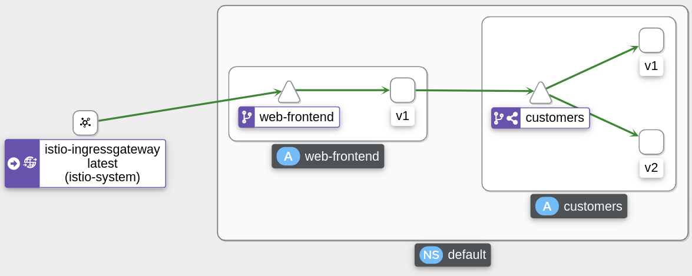

# Simple traffic routing using Virtual Service + SubSets - routing based on weights

Based on https://academy.tetrate.io/courses/take/istio-fundamentals/lessons/19068822-lab-3-simple-traffic-routing

## Prerequisites

- clean minikube cluster
- Istio Demo profile installed
- `default` namespace labeled for istio sidecar auto-injection: istio-injection=enabled

## Steps 

- create Ingress Gateway
	```sh
	kubectl apply -f gateway.yaml
    kubectl get gateway
    NAME               AGE
    gateway            60s    
	```

- get and remember ingress IP (minikube tunnel first, to get External IP)
    ```sh
    kubectl get svc -n istio-system -l app=istio-ingressgateway
    NAME                   TYPE           CLUSTER-IP    EXTERNAL-IP   PORT(S)                                                                      AGE
    istio-ingressgateway   LoadBalancer   10.98.23.63   10.98.23.63   15021:30356/TCP,80:32547/TCP,443:32524/TCP,31400:30726/TCP,15443:30339/TCP   4d4h
    export GATEWAY_URL=10.98.23.63
    ```

- create the web-frontend (deployment + service)
    ```sh
    kubectl apply -f web-frontend.yaml
    kubectl get deploy,pod,svc
    NAME                           READY   UP-TO-DATE   AVAILABLE   AGE
    deployment.apps/web-frontend   1/1     1            1           17s

    NAME                                READY   STATUS    RESTARTS   AGE
    pod/web-frontend-69b64f974c-4x66g   2/2     Running   0          17s

    NAME                   TYPE        CLUSTER-IP       EXTERNAL-IP   PORT(S)   AGE
    service/kubernetes     ClusterIP   10.96.0.1        <none>        443/TCP   242d
    service/web-frontend   ClusterIP   10.103.105.120   <none>        80/TCP    17s
    ```
    Envoy proxy sidecar is automatically injected in the application's Pod

- create the customers-v1 (deployment + service)
    ```sh
    kubectl apply -f customers-v1.yaml
    kubectl get deploy,pod,svc
    NAME                           READY   UP-TO-DATE   AVAILABLE   AGE
    deployment.apps/customers-v1   1/1     1            1           11s
    deployment.apps/web-frontend   1/1     1            1           4m8s

    NAME                                READY   STATUS    RESTARTS   AGE
    pod/customers-v1-7b5b4b76fc-fprwr   2/2     Running   0          11s
    pod/web-frontend-69b64f974c-4x66g   2/2     Running   0          4m8s

    NAME                   TYPE        CLUSTER-IP       EXTERNAL-IP   PORT(S)   AGE
    service/customers      ClusterIP   10.98.217.127    <none>        80/TCP    11s
    service/kubernetes     ClusterIP   10.96.0.1        <none>        443/TCP   242d
    service/web-frontend   ClusterIP   10.103.105.120   <none>        80/TCP    4m8s
    ```

- create Virtual Service for web-frontend
    ```sh
    kubectl apply -f web-frontend-vs.yaml
    kubectl get vs
    NAME           GATEWAYS      HOSTS   AGE
    web-frontend   ["gateway"]   ["*"]   3s
    ```
    
- open the frontend page, customers-v1 is served
    ```sh
    firefox $GATEWAY_URL
    ```

- create the customers-v2 (just deployment; reusing service of customers-v1) - this deployment adds "CITY" column
    ```sh
    kubectl apply -f customers-v2.yaml
    kubectl get deploy,pod,svc
    NAME                           READY   UP-TO-DATE   AVAILABLE   AGE
    deployment.apps/customers-v1   1/1     1            1           7m28s
    deployment.apps/customers-v2   1/1     1            1           10s
    deployment.apps/web-frontend   1/1     1            1           7m36s

    NAME                                READY   STATUS    RESTARTS   AGE
    pod/customers-v1-7b5b4b76fc-z44xm   2/2     Running   0          7m28s
    pod/customers-v2-6bc699b6cc-2744g   2/2     Running   0          10s
    pod/web-frontend-69b64f974c-4sws4   2/2     Running   0          7m36s

    NAME                   TYPE        CLUSTER-IP     EXTERNAL-IP   PORT(S)   AGE
    service/customers      ClusterIP   10.107.25.23   <none>        80/TCP    7m28s
    service/kubernetes     ClusterIP   10.96.0.1      <none>        443/TCP   242d
    service/web-frontend   ClusterIP   10.98.55.208   <none>        80/TCP    7m36s
    ```
    , now customers-v1 and customers-v2 PODs are load-balanced equally

- now create  DestinationRule with subsets: v1 and v2
    ```sh
    kubectl apply -f customers-dr.yaml
    kubectl get dr
    NAME        HOST                                  AGE
    customers   customers.default.svc.cluster.local   20s
    ```

- create VirtualService for customers app to load balance traffic between v1 (10%) and v2 (90%) using the subsets
    ```sh
    kubectl apply -f customers-vs-10-90.yaml
    kubectl get vs
    NAME           GATEWAYS      HOSTS                                     AGE
    customers                    ["customers.default.svc.cluster.local"]   5s
    web-frontend   ["gateway"]   ["*"]                                     14m
    ```
- open the frontend page, v1 and v2 is served in proportions 10% - 90%
    ```sh
    firefox $GATEWAY_URL
    ```

- also, see traffic being loadbalanced in Kiali
    ```sh
    istioctl dash kiali
    ```
    

## Clean Up

```sh
kubectl delete deploy web-frontend customers-{v1,v2}
kubectl delete svc customers web-frontend
kubectl delete vs customers web-frontend
kubectl delete dr customers
kubectl delete gateway gateway
```