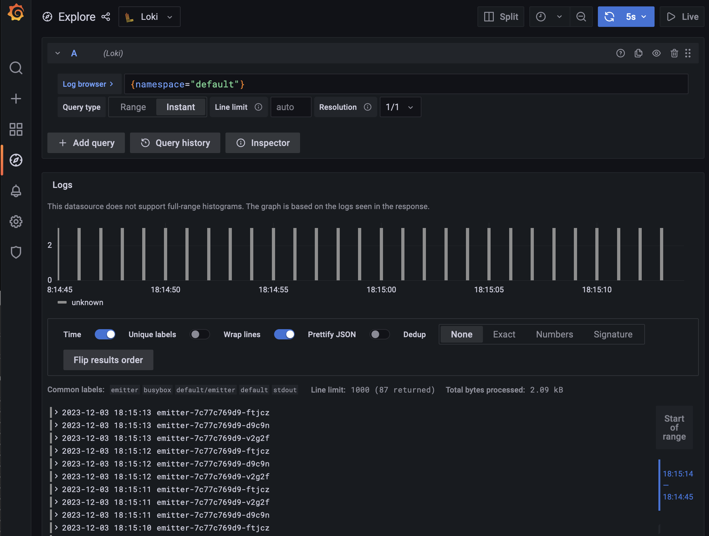

# Kubernetes + LOKI

- LOKI for logs does the same as Prometheus for metrics
- Grafana has built-in support for LOKI
- https://piotrminkowski.com/2023/07/20/logging-in-kubernetes-with-loki/

## Install

deploy Helm chart:
```sh
helm repo add grafana https://grafana.github.io/helm-charts
helm install loki grafana/loki-stack -n loki-stack --set grafana.enabled=true --create-namespace
```
verify:
```sh
kubectl get po -n loki-stack
NAME                            READY   STATUS              RESTARTS   AGE
loki-0                          1/1     ContainerCreating   0          67s
loki-grafana-6646bdff57-n4fwt   2/2     ContainerCreating   0          67s
loki-promtail-n7jtc             1/1     ContainerCreating   0          67s
```
port forwarding to grafana:
```sh
kubectl port-forward svc/loki-grafana 3000:80 -n loki-stack
```
get admin password:
```sh
kubectl get secret -n loki-stack loki-grafana -o jsonpath="{.data.admin-password}" | base64 --decode ; echo
JMMcYIlhc90xdbHt9onCeOMr9uPqE9Iv41PRK0Bj
```

## Run log-emitter

```sh
kubectl create deploy emitter --image=busybox --replicas=3 -- sh -c 'while true; do hostname; sleep 1; done'
```

## See logs in Grafana

- login: admin
- pass: JMMcYIlhc90xdbHt9onCeOMr9uPqE9Iv41PRK0Bj
```sh
firefox localhost:3000
```

Data source "Loki" is already set up; select `Log browser` -> `namespace` -> `default` and click `Show logs`


