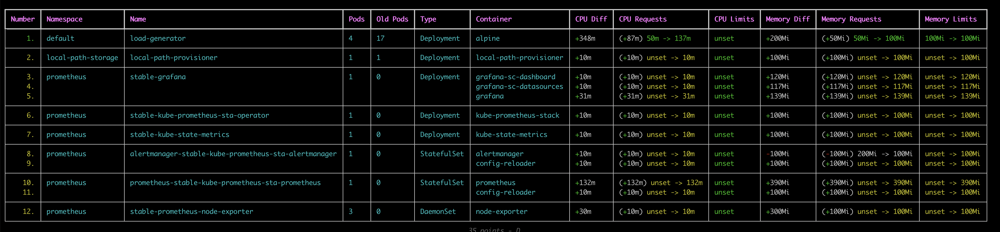

# Robusta KRR - Prometheus-based Kubernetes Resource Recommendations

https://github.com/robusta-dev/krr

## Prerequisite

KRR needs cluster with Prometheus operator installed:  
[Kubernetes+Prometheus+Grafana](../Kubernetes+Prometheus+Grafana/README.md)

## Install kube-state-metrics in the cluster, for better reccommendations

https://github.com/kubernetes/kube-state-metrics

```sh
git clone https://github.com/kubernetes/kube-state-metrics.git
kubectl apply -f kube-state-metrics/examples/standard
```

kube-state-metrics gets installed in kube-system namespace:
```sh
kubectl get deploy -n kube-system kube-state-metrics
NAME                 READY   UP-TO-DATE   AVAILABLE   AGE
kube-state-metrics   1/1     1            1           56m
```

## Install KRR (macos)

```sh
brew tap robusta-dev/homebrew-krr
brew install krr
krr --help
```

## Run KRR

```
kubectl port-forward -n prometheus svc/stable-kube-prometheus-sta-prometheus 9090:9090 
krr simple -v --prometheus-url http://localhost:9090
```

Output:
