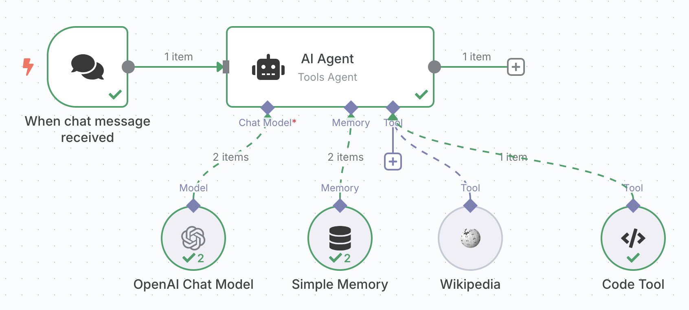

# N8N nocode study

Based on https://www.youtube.com/watch?v=VdLUgCm_H5w.  

## Run N8N locally

```sh
docker run -d --name n8n --rm -p 5678:5678 -v "$(PWD)/.n8n:/homem/node/.n8n" n8nio/n8n:latest
firefox http://localhost:5678
# import workflow "My_workflow.json"
```

## My_workflow.json

Components - AI agent integrated with:
- Chat GPT 
- Local memory
- Wikipedia


